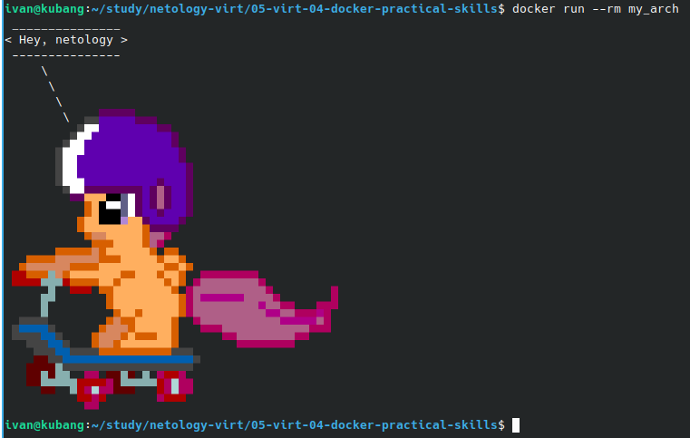
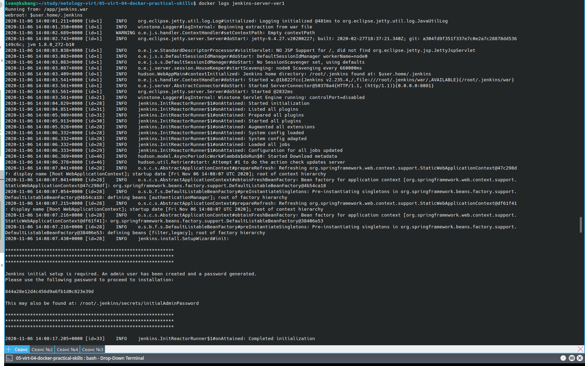
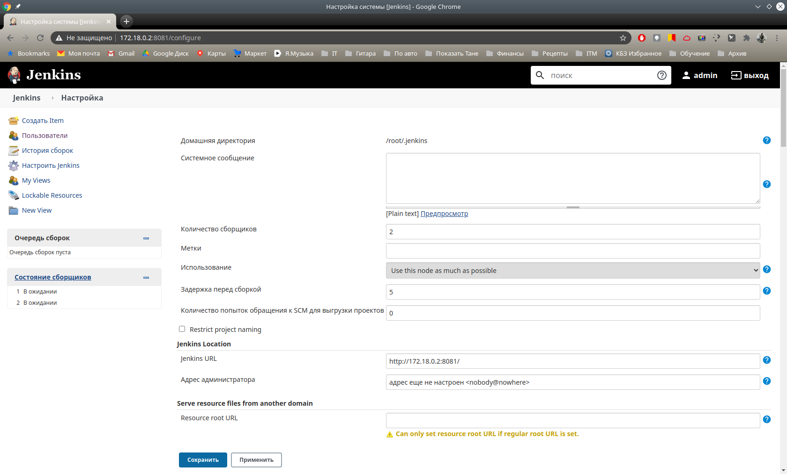
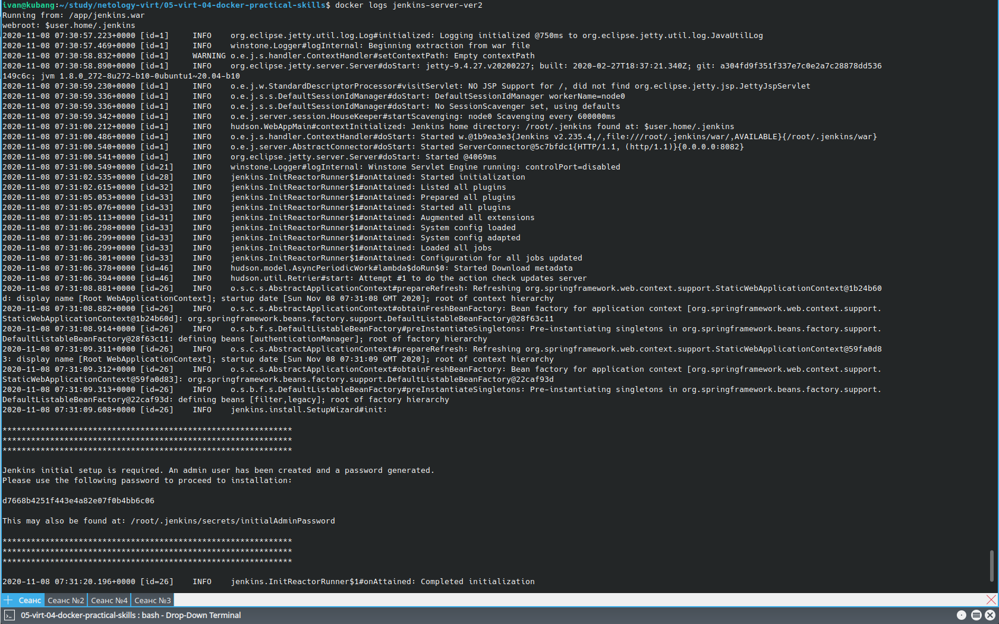
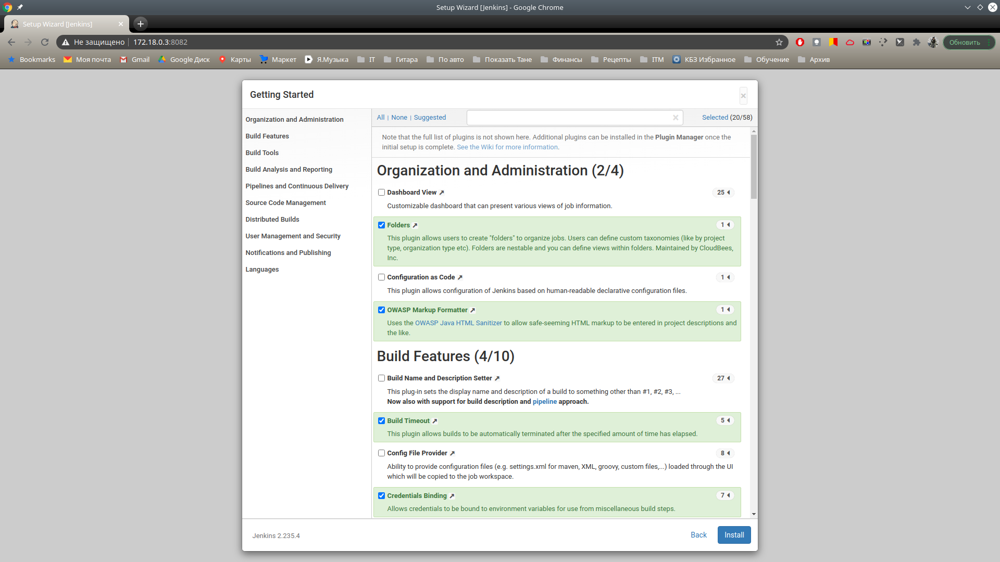
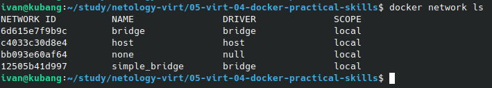
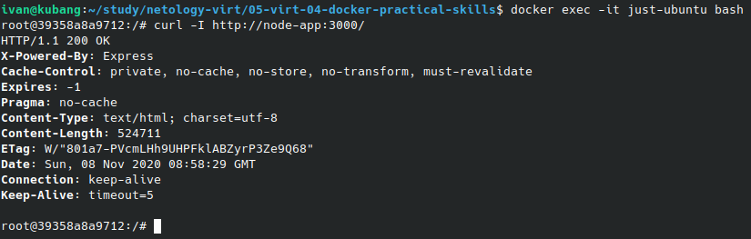

# Домашнее задание к занятию "5.4. Практические навыки работы с Docker"

## Модуль 5. Виртуализация

### Студент: Иван Жиляев

## Задача 1 

>В данном задании вы научитесь изменять существующие Dockerfile, адаптируя их под нужный инфраструктурный стек.
>
>Измените базовый образ предложенного Dockerfile на Arch Linux c сохранением его функциональности.
>
>```text
>FROM ubuntu:latest
>
>RUN apt-get update && \
>    apt-get install -y software-properties-common && \
>    add-apt-repository ppa:vincent-c/ponysay && \
>    apt-get update
> 
>RUN apt-get install -y ponysay
>
>ENTRYPOINT ["/usr/bin/ponysay"]
>CMD ["Hey, netology”]
>```
>
>Для получения зачета, вам необходимо предоставить:
>- Написанный вами Dockerfile
>- Скриншот вывода командной строки после запуска контейнера из вашего базового образа
>- Ссылку на образ в вашем хранилище docker-hub

-  Вот написанный мной [Dockerfile](task1/Dockerfile).  
   В ходе его составления я не увидел толка оставлять несколько секций RUN и поместил обновление информации о пакетах и установку требуемой программы в один RUN.  
   Также для сохранения красивого вывода пришлось изменить ENTRYPOINT на bash, чтобы появилась возможность перенаправить STDERR в /dev/null - без этого на экран дополнительно выводились предупреждения от интерпретатора Python3.8:
   
   ```
   /usr/bin/ponysay/backend.py:294: SyntaxWarning: "is not" with a literal. Did you mean "!="?
   /usr/bin/ponysay/backend.py:294: SyntaxWarning: "is not" with a literal. Did you mean "!="?
   ```

-  Базовый образ локально собираю командой:

   ```
   docker build -t my_arch -f task1/Dockerfile .
   ```

   Запустим контейнер для снимка скриншота командой:

   ```
   docker run --rm my_arch
   ```

   Получившийся скриншот:  
   

-  Для размещения образа в DockerHub я изменил имя и тэг образа:

   ```
   docker tag my_arch:latest nimlock/netology-homework-5.4-task1
   ```

   Затем, так как я уже авторизовался ранее CLI-клиентом docker на DockerHub, для выгрузки образа достаточно команды:

   ```
   docker push nimlock/netology-homework-5.4-task1
   ```

   В итоге получил [ссылку](https://hub.docker.com/layers/nimlock/netology-homework-5.4-task1/latest/images/sha256-b3027f488277ce33123eb8ef771df5e4ede8e106188097337877a33fe8f9fd9f?context=explore) на образ.

## Задача 2 

>В данной задаче вы составите несколько разных Dockerfile для проекта Jenkins, опубликуем образ в `dockerhub.io` и посмотрим логи этих контейнеров.
>
>- Составьте 2 Dockerfile:
>
>    - Общие моменты:
>        - Образ должен запускать [Jenkins server](https://www.jenkins.io/download/)
>        
>    - Спецификация первого образа:
>        - Базовый образ - [amazoncorreto](https://hub.docker.com/_/amazoncorretto)
>        - Присвоить образу тэг `ver1` 
>    
>    - Спецификация второго образа:
>        - Базовый образ - [ubuntu:latest](https://hub.docker.com/_/ubuntu)
>        - Присвоить образу тэг `ver2` 
>
>- Соберите 2 образа по полученным Dockerfile
>- Запустите и проверьте их работоспособность
>- Опубликуйте образы в своём dockerhub.io хранилище
>
>Для получения зачета, вам необходимо предоставить:
>- Наполнения 2х Dockerfile из задания
>- Скриншоты логов запущенных вами контейнеров (из командной строки)
>- Скриншоты веб-интерфейса Jenkins запущенных вами контейнеров (достаточно 1 скриншота на контейнер)
>- Ссылки на образы в вашем хранилище docker-hub

### Работа над первым образом

В первом Dockerfile буду устанавливать Jenkins из [war-файла со страницы разработчиков](https://get.jenkins.io/war-stable/latest/jenkins.war), так как в образе [amazoncorreto](https://hub.docker.com/_/amazoncorretto) уже установлен OpenJDK. Так как версия "latest" на самом деле не является последней (она ведёт на 2.235.4, хотя последняя - 2.249.3), то добавлю возможность указать желаемую версию при сборке образа через опцию `--build-arg JENKINS_VER=<value>`. Так как частой пересборки образа не ожидается, то для добавления в образ Jenkins-а использую инструкцию ADD: она позволит не беспокоиться за актуальность файла, так как будет скачивать его каждую сборку. Если бы файл был большой и/или планировалось часто обновлять образ, то применил бы инструкцию COPY к заранее скачанному в контекст сборки файлу.

Раз у нас планируется несколько инстансов одного сервиса, то, возможно, будет полезным добавить возможность менять порт работы приложения. По дефолту пусть работает на порту 8081, однако данный параметр можно будет переопределить как при сборке образа через опцию `--build-arg JENKINS_HTTP_PORT=<value>`, так и при запуске контейнера через опцию `--env JENKINS_HTTP_PORT=<value>`.

Запустим сборку первого образа из его [Dockerfile](task2/Dockerfile1) и сразу запустим контейнер командами:

```
docker build -t jenkins-server:ver1 -f task2/Dockerfile1 .
docker run --name jenkins-server-ver1 -d jenkins-server:ver1
```

Для получения автоматически сгенерированного административного пароля выполним команду:

```
docker exec jenkins-server-ver1 cat /root/.jenkins/secrets/initialAdminPassword
```

Убедившись, что всё работает исправно можно переименовать и залить образ командами:

```
docker tag jenkins-server:ver1 nimlock/netology-homework-5.4-task2:ver1
docker push nimlock/netology-homework-5.4-task2:ver1 
```

### Работа над вторым образом

Так как второй образ должен быть основан на ubuntu, то установку приложения сперва хотел выполнять из deb-пакета, однако возникли неразрешимые трудности с запуском контейнера из-за метода запуска Jenkins как демона (так это предполагается по логике deb-паекта). В итоге решил прибегнуть к той же схеме, что и с первым образом: запуск в OpenJDK готового war-файла с приложением.  
Функции выбора версии приложения и порта http для него работают так же как и для первого образа.

Запустим сборку второго образа из его [Dockerfile](task2/Dockerfile2) и сразу запустим контейнер командами:

```
docker build -t jenkins-server:ver2 -f task2/Dockerfile2 .
docker run --name jenkins-server-ver2 -d jenkins-server:ver2
```

Для получения автоматически сгенерированного административного пароля выполним команду:

```
docker exec jenkins-server-ver2 cat /root/.jenkins/secrets/initialAdminPassword
```

Убедившись, что всё работает исправно можно переименовать и залить образ командами:

```
docker tag jenkins-server:ver2 nimlock/netology-homework-5.4-task2:ver2
docker push nimlock/netology-homework-5.4-task2:ver2 
```

### Результаты выполнения задачи

- Для первого образа
  - [Dockerfile](task2/Dockerfile1)
  - скриншот логов  
  
  - скриншот приложения  
  
  - [ссылка на образ в DockerHub](https://hub.docker.com/layers/nimlock/netology-homework-5.4-task2/ver1/images/sha256-f050745cbbc12c90bdc87389511d02a39ae2651b00e28ae6f7458c72b31e6d0c?context=repo)
- Для второго образа
  - [Dockerfile](task2/Dockerfile2)
  - скриншот логов  
  
  - скриншот приложения  
  
  - [ссылка на образ в DockerHub](https://hub.docker.com/layers/nimlock/netology-homework-5.4-task2/ver2/images/sha256-2834e5ed63ce4925cd3a6abaeefa5f6a31d7a92eb0b01ea2c3b9cfa140140c6c?context=repo)

## Задача 3 

>В данном задании вы научитесь:
>- объединять контейнеры в единую сеть
>- исполнять команды "изнутри" контейнера
>
>Для выполнения задания вам нужно:
>- Написать Dockerfile: 
>    - Использовать образ https://hub.docker.com/_/node как базовый
>    - Установить необходимые зависимые библиотеки для запуска npm приложения https://github.com/simplicitesoftware/nodejs-demo
>    - Выставить у приложения (и контейнера) порт 3000 для прослушки входящих запросов  
>    - Соберите образ и запустите контейнер в фоновом режиме с публикацией порта
>
>- Запустить второй контейнер из образа ubuntu:latest 
>- Создайть `docker network` и добавьте в нее оба запущенных контейнера
>- Используя `docker exec` запустить командную строку контейнера `ubuntu` в интерактивном режиме
>- Используя утилиту `curl` вызвать путь `/` контейнера с npm приложением  
>
>Для получения зачета, вам необходимо предоставить:
>- Наполнение Dockerfile с npm приложением
>- Скриншот вывода вызова команды списка docker сетей (docker network cli)
>- Скриншот вызова утилиты curl с успешным ответом

### Работа над первым образом

План решения задачи: подключить в контейнер кодовую базу с приложением через git, установить зависимости приложения через `npm install` и запустить приложение с желаемыми параметрами через `npm start`. Yarn в данном случае использовать не стоит, так как приложение разрабатывалось при помощи npm (это видно по файлу с использованными зависимостями package-lock.json), а смена пакетного менеджера без оснований не приветствуется.  
В базовом образе уже присутствуют все необходимые программы (git, npm), так что можно обойтись без их установки.

В [Dockerfile](task3/Dockerfile) описаны необходимые инструкции для сборки образа. Из основного файла приложения [app.js](https://github.com/simplicitesoftware/nodejs-demo/blob/master/app.js#L29-L30) видно, что для определения порта приложения можно использовать переменную окружения `VCAP_APP_PORT`, а для изменения "области видимости" приложения - переменную `VCAP_APP_HOST`. Подготовим образ и запустим контейнер:

```
docker build -t node-app -f task3/Dockerfile .
docker run --name node-app -d node-app
```

### Работа над вторым образом

Для запуска второго контейнера на ubuntu:latest в detached-режиме воспользуемся командой:

```
docker run --name just-ubuntu --rm -d ubuntu:latest sleep infinity
```

Теперь организуем отдельную сеть для наших контейнеров и соединим их, выполнив команды:

```
docker network create --internal simple_bridge
docker network connect simple_bridge just-ubuntu
docker network connect simple_bridge node-app
```

Так как в образе ubuntu:latest отсутствует curl, то установим его командой:

```
docker exec just-ubuntu bash -c 'apt update && apt install -y curl'
```

Подключимся к контейнеру интерактивно командой:

```
docker exec -it just-ubuntu bash
```

Выполним обращение к первому контейнеру __по имени контейнера, а не по его ip-адресу__ - это, как мне кажется, и есть преимущество создания отдельной сети в данном задании. Для сокращения вывода добавим ключ `-I`:

```
curl -I http://node-app:3000/
```

### Результаты выполнения задачи

- [Dockerfile с nodejs-приложением](task3/Dockerfile)
- скриншот со списком Docker-сетей:  

- скриншот с выводом curl:  

