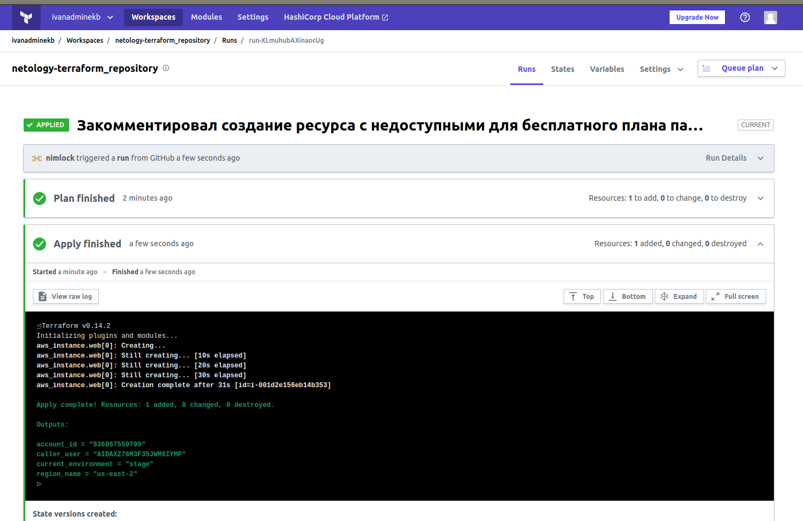

# Домашнее задание к занятию "7.4. Средства командной работы над инфраструктурой."

## Модуль 7. Облачная инфраструктура. Terraform

### Студент: Иван Жиляев

## Задача 1. Настроить terraform cloud (необязательно, но крайне желательно).

>В это задании предлагается познакомиться со средством командой работы над инфраструктурой предоставляемым
>разработчиками терраформа. 
>
>1. Зарегистрируйтесь на [https://app.terraform.io/](https://app.terraform.io/).
>(регистрация бесплатная и не требует использования платежных инструментов).
>1. Создайте в своем github аккаунте (или другом хранилище репозиториев) отдельный репозиторий с
> конфигурационными файлами прошлых занятий (или воспользуйтесь любым простым конфигом).
>1. Зарегистрируйте этот репозиторий в [https://app.terraform.io/](https://app.terraform.io/).
>1. Выполните plan и apply. 
>
>В качестве результата задания приложите снимок экрана с успешным применением конфигурации.

1. С регистрацией на [https://app.terraform.io/](https://app.terraform.io/) проблем не возникло.

1. Вынес проект terraform-а в [отдельный репозиторий](https://github.com/nimlock/netology-terraform_repository).

1. Зарегистрировал этот репозиторий в Terraform Cloud.

1. Переписал конфигурацию для того, чтобы окружение инфраструктуры задавалось не через build-in переменную `terraform.workspace` (которая не может быть изменена с `default` в Terraform Cloud), а через `input variable` "kvazi_workspace". Таким образом получилось сохранить логику выполнения конфигурации.

   _Прим.: уже после выполнения изменений конфигурации обнаружил нужную переменную [TFC_WORKSPACE_NAME](https://www.terraform.io/docs/cloud/run/run-environment.html#tfc_workspace_name)._

1. Выполнил plan и apply, результат выполнения

   


## Задача 2. Написать серверный конфиг для атлантиса. 

>Смысл задания – познакомиться с документацией 
>о [серверной](https://www.runatlantis.io/docs/server-side-repo-config.html) конфигурации и конфигурации уровня 
> [репозитория](https://www.runatlantis.io/docs/repo-level-atlantis-yaml.html).
>
>Создай `server.yaml` который скажет атлантису:
>1. Укажите, что атлантис должен работать только для репозиториев в вашем github (или любом другом) аккаунте.
>1. На стороне клиентского конфига разрешите изменять `workflow`, то есть для каждого репозитория можно 
>будет указать свои дополнительные команды. 
>1. В `workflow` используемом по-умолчанию сделайте так, что бы во время планирования не происходил `lock` состояния.
>
>Создай `atlantis.yaml` который, если поместить в корень terraform проекта, скажет атлантису:
>1. Надо запускать планирование и аплай для двух воркспейсов `stage` и `prod`.
>1. Необходимо включить автопланирование при изменении любых файлов `*.tf`.
>
>В качестве результата приложите ссылку на файлы `server.yaml` и `atlantis.yaml`.

В качестве основы для конфигурационных файлов я использовал примеры с соответствующих страниц документации.

Изменения в конфигурациях, относительно исходных версий:

- для [файла `server.yaml`](server.yaml):

  1. Укажем адрес репозитория в параметре `repos[id]`.
  1. За эту возможность отвечает параметр `repos[allow_custom_workflows]` и он уже установлен в true.
  1. Блокировка состояния уже снята в примере конфига параметрм `workflows.custom.plan.steps[plan].extra_args.["-lock", "false"]`.

- для [файла `atlantis.yaml`](atlantis.yaml):

  1. Чтобы действия призводились сразу над двумя workspace-ами небходимо определить их как отдельные проекты с единой директорией, но различными параметрами `workspace`. Параметр `workflow: myworkflow` определяет, что нужно выполнить описанный ниже индивидуальный workflow. В нём можно задать требуемые действия.

  1. Включим автопланирование параметрами `autoplan:[when_modified:["*.tf", "./**.tf"],enabled:true]`

## Задача 3. Знакомство с каталогом модулей. 

>1. В [каталоге модулей](https://registry.terraform.io/browse/modules) найдите официальный модуль от aws для создания
>`ec2` инстансов. 
>2. Изучите как устроен модуль. Задумайтесь, будете ли в своем проекте использовать этот модуль или непосредственно 
>ресурс `aws_instance` без помощи модуля?
>3. В рамках предпоследнего задания был создан ec2 при помощи ресурса `aws_instance`. 
>Создайте аналогичный инстанс при помощи найденного модуля.   
>
>В качестве результата задания приложите ссылку на созданный блок конфигураций.

1. Нашёл требуемый [модуль](https://registry.terraform.io/modules/terraform-aws-modules/ec2-instance/aws/latest).

1. Не вижу смысла использовать данный модуль, т.к. он по сути состоит из одного функционального блока и это `resource "aws_instance"`. Мне не нравится наличие лишних строк кода в конфигурации, при необходимости я сам хотел бы задать желаемые параметры для ресурса.

1. В конфигурацию проекта terraform добавим блок с описанием модуля, после чего, в случае локального исполнения кода, выполним `terraform init` для его подгрузки в проект после чего можно разворачивать инфраструктуру:

    ```
    module "ec2_module" {
      source = "terraform-aws-modules/ec2-instance/aws"

      instance_count = 1

      name          = "done-with-ec2_module"
      ami           = data.aws_ami.ubuntu.id
      instance_type = local.dict_of_instance_types[var.kvazi_workspace]
    }
    ```

Необходимые блоки конфигурации я дописал в [main.tf репозитория](https://github.com/nimlock/netology-terraform_repository/blob/14f25e65ac1b76dcb3bcc495f9ae097ae0e10d6b/main.tf), Terraform Cloud успешно обновил инфраструктуру.
